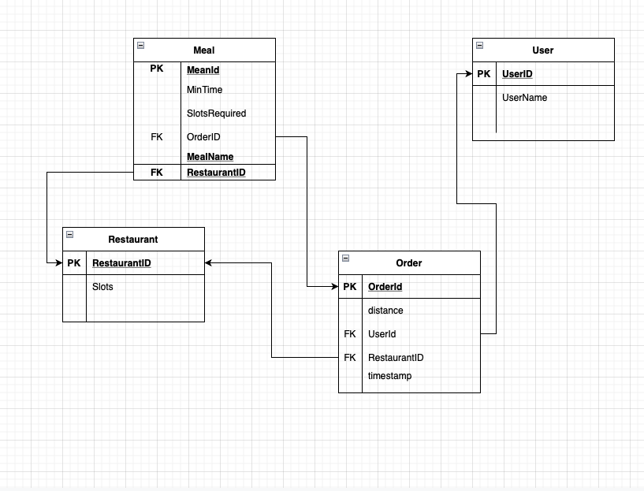

# Assignment - Delivery System (Food)

Solution to question 2

Whenver someone Creates Order
1. We add order to DB .
ex - {order1, userid, timestamp, distance, restaurantID} .
inserting user first -
INSERT INTO user(userId, username) VALUES (‘1001’, ‘Mukesh');
INSERT INTO restaurnat(restaurnatid, slots) VALUES (‘1011’, '10');

  adding orders
  INSERT INTO Order(Orderid, userid,timestamp,distance,restaurantID,completed) VALUES (‘901’, '1001','12-12-12:00','10','1011','false');

  like this we will insert orders

2. If user updates order we pick it up by unique orderID

  first lets we add meal to order
  INSERT INTO meal(mealid, mintime,slots,orderid,mealname,restaurantID) VALUES
   ('1990', '18','3','901','yummy','1011');

   SELECT * from order from order INNER JOIN meal ON order.orderID = meal.orderID;

3. User can modify future orders as we can check them by timestamps or if they are not processed by checking their completed column
 SELECT * from order ORDER BY timestamp ASC;

4. We pick orders one by one from DB according to their timestamp

We can checkif order is completed or not as we have column for it.
and we pick them one by one if cant be completed we update the table for completed = false.
If order is modifed then we update the timestamp to current time and add it to queue again at the end.
in our app we have queue to maintain all the incoming orders.
